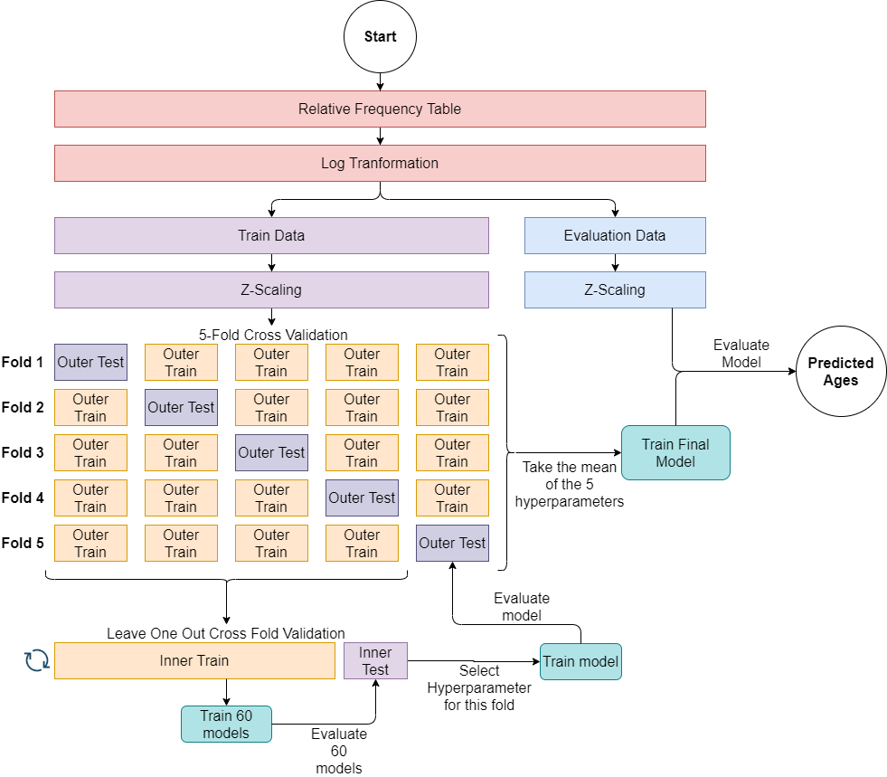

# Age Prediction
These scripts contain a machine learning algorithm to predict age based on a relative frequency table of cluster percentages. This algorithm uses a nested cross fold validation for hyperparameter selection. See the workflow at the end of this file for a detailed description of the algorithm.

## Input Data
This algorithm works on a relative frequency table of the percentage of cells each sample has in a cluster. Each row of the table represents a sample and each column a relative frequency of a cluster. Make sure that the feature you want predict is added as a column. RelativeFrequencyTable_example.csv is an example of input data.

## Run the algorithm
To run the algoritm you have to change some settings in the script Predict_Age.R
* Change "directory" to the directory where the scripts and relative frequency table are located.
* Change "test_variable" to the feature you want to predict.
* Set the file name of your relative frequency table and change columnnames at step 4
* Select columns which contain cluster data in step 6

After that you can run the script Predict_Age.R

